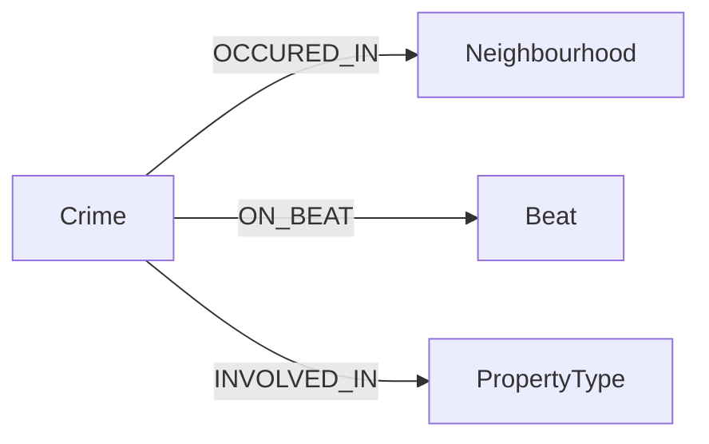

# Neo4j Crime Graph Analytics

Graph-based crime investigation and network analysis using Neo4j and Cypher.

This project demonstrates how graph databases can uncover hidden relationships within criminal networks, enabling investigators to identify key suspects, collaboration patterns, and crime hotspots that may not be visible using traditional relational databases.

By modelling crime data as a network of people, crimes, and locations, investigators can perform relationship-driven analysis to understand criminal behaviour and network structures.

Typical investigative questions this graph can answer include:

- Which suspects collaborated on criminal activities?
- Which suspects are central figures within the network?
- Which locations appear most frequently in crime records?
- Which individuals are connected through indirect criminal associations?

Graph databases are widely used in:

- law enforcement investigations
- fraud detection
- intelligence analysis
- cybercrime network mapping

## Project Overview

Traditional relational databases store information in tables, making it difficult to analyse complex relationships between entities.

Graph databases such as Neo4j represent data as:

- Nodes → entities (people, crimes, locations)
- Relationships → connections between entities
- Properties → attributes of nodes and relationships

This project constructs a crime investigation network where suspects, crimes, and locations are connected through relationships that can be explored using Cypher queries.

Investigators can then identify patterns such as:

- suspects committing multiple crimes
- criminal collaboration networks
- frequently targeted locations
- central figures within criminal organisations

### Technology Used
| Technology | Purpose |
| ----- | ----- |
| Neo4j | Graph database engine |
| Cypher | Graph query language |
| Neo4j Browser | Interactive graph visualization |
| Graph Data Modelling | Relationship-driven data representation |
| Graph Algorithm | Network analysis and pattern detection |


### Graph Data Model

The dataset models **crime incidents and their associated contextual information** using Neo4j.

Instead of analysing suspect relationships, the graph focuses on **where crimes occur and the type of crime involved**.

#### Nodes
| Node | Description |
| ----- | ----- |
| Crime | Individual crime incident |
| Beat | Police patrol beat where the crime occurred |
| Neighborhood | Neighborhood where the crime took place |
| PropertyType | Type of property involved in the crime 


#### Relationship Types
| Relationship | Description |
| ----- | ----- |
| OCCURRED_IN | Crime occurred within a specific neighborhood |
| ON_BEAT | Crime took place within a police beat |
| INVOLVED_IN | Crime involved a particular property type |

#### Graph Schema


#### Example Cypher Queries 

- Find crimes in a specific neighborhood
```text
MATCH (c:Crime)-[:OCCURRED_IN]->(n:Neighborhood)
WHERE n.name = "Loop"
RETURN c
LIMIT 25
```
  
- Identify neighborhoods with the highest crime counts
```text
MATCH (c:Crime)-[:OCCURRED_IN]->(n:Neighborhood)
RETURN n.name AS neighborhood, COUNT(c) AS crimeCount
ORDER BY crimeCount DESC
```
  
- Identify beats with the most crime incidents
```text
MATCH (c:Crime)-[:ON_BEAT]->(b:Beat)
RETURN b.name AS beat, COUNT(c) AS crimeCount
ORDER BY crimeCount DESC
```

- Identify property types most frequently involved in crimes
```text
MATCH (c:Crime)-[:INVOLVED_IN]->(p:PropertyType)
RETURN p.name AS propertyType, COUNT(c) AS incidents
ORDER BY incidents DESC
```

#### Advanced Graph Analytics Queries

Beyond simple data retrieval, graph databases enable analysts to explore spatial and contextual relationships within crime data.

The following queries demonstrate how graph traversal can reveal crime distribution patterns across neighborhoods, police beats, and property types.

- Identify Crime Hotspots by Neighborhood
```text
MATCH (c:Crime)-[:OCCURRED_IN]->(n:Neighborhood)
RETURN n.name AS neighborhood, COUNT(c) AS crimeCount
ORDER BY crimeCount DESC
LIMIT 10
```
This query identifies neighborhoods with the highest number of reported crimes.

Such analysis can assist law enforcement in identifying **crime hotspots** and prioritizing patrol deployment.

- Identify Police Beats with the Highest Crime Activity
```text
MATCH (c:Crime)-[:ON_BEAT]->(b:Beat)
RETURN b.name AS beat, COUNT(c) AS crimeCount
ORDER BY crimeCount DESC
```
This allows analysts to determine which patrol beats experience the most criminal activity.

- Identify Property Types Most Frequently Involved in Crimes
```text
MATCH (c:Crime)-[:INVOLVED_IN]->(p:PropertyType)
RETURN p.name AS propertyType, COUNT(c) AS incidents
ORDER BY incidents DESC
```
This analysis highlights which types of properties are most frequently targeted in crimes.

- Cross-Analysis: Property Type Distribution by Neighborhood
```text
MATCH (c:Crime)-[:OCCURRED_IN]->(n:Neighborhood),
      (c)-[:INVOLVED_IN]->(p:PropertyType)
RETURN n.name AS neighborhood,
       p.name AS propertyType,
       COUNT(c) AS incidents
ORDER BY incidents DESC
```
This query reveals which types of properties are frequently associated with crime in specific neighborhoods.

### Network Analysis: Spatial Crime Patterns

While this dataset does not model individuals or criminal networks, graph analysis can still reveal important spatial patterns.

By analysing the connections between crimes, locations, and property types, analysts can detect:

• geographic crime concentration  
• high-activity patrol beats  
• frequently targeted property categories  
• patterns of crime distribution across neighborhoods

Example: Identifying Neighborhood–Beat Relationships
```text
MATCH (c:Crime)-[:OCCURRED_IN]->(n:Neighborhood),
      (c)-[:ON_BEAT]->(b:Beat)
RETURN n.name AS neighborhood,
       b.name AS beat,
       COUNT(c) AS incidents
ORDER BY incidents DESC
```
This query helps identify which patrol beats are responsible for areas experiencing higher crime activity.

### Graph Visualization & Analytics

One of the major strengths of graph databases such as Neo4j is the ability to visually explore relationships within the data.

Using Neo4j Browser, crime incidents can be visualized alongside their associated neighborhoods, beats, and property types.

Visual exploration allows analysts to quickly identify:

• neighborhoods with dense clusters of crime  
• police beats associated with high crime activity  
• frequently targeted property types  
• patterns of crime distribution across geographic regions

Example visualization:


The interactive visualization enables investigators and analysts to explore relationships dynamically by expanding nodes and traversing connections.

Using graph queries, investigators and analysts can identify patterns such as:
• crime hotspots by neighborhood  
• high-activity police beats  
• property types frequently targeted  
• distribution of crimes across different regions

Graph traversal allows analysts to quickly explore relationships between crimes and their locations, enabling faster insights compared to traditional relational queries.

### Key Learning Outcomes
This project demonstrates several important concepts in graph-based data analysis.

| Graph Data Modeling | Understanding how relational datasets can be transformed into graph structures using: <br> • nodes <br> • relationships <br> • node properties <br> |
| Cypher Query Development | Developing queries to explore relationships and extract insights from graph databases |
| Spatial Crime Analysis | Using graph traversal to analyze crime distribution across neighborhoods and patrol beats |
| Data Exploration | Using Neo4j’s interactive graph visualization tools to explore connected datasets |
| Graph-Based Analytics | Applying graph structures to identify crime patterns that are difficult to observe using traditional relational databases |
  
## Why Graph Databases for Crime Analysis?

Crime datasets often involve multiple interconnected attributes such as location, incident type, and contextual information.

Graph databases provide several advantages when analysing such data.

### Natural Representation of Relationships

Graph structures naturally represent relationships between crimes and their associated attributes.

### Efficient Relationship Traversal

Neo4j enables fast traversal across connected data, making it easier to explore relationships between entities.

### Flexible Data Exploration

Analysts can explore crime patterns dynamically without needing complex SQL joins.

### Visual Network Exploration

Graph visualization tools allow investigators to visually identify clusters, hotspots, and relationships within the data.

Because of these advantages, graph databases are increasingly used in:

• crime analytics  
• fraud detection  
• intelligence analysis  
• cybersecurity investigations

## Future Improvements

This project can be extended in several ways to further enhance crime analysis capabilities.

Possible improvements include:

• integrating time-based analysis to detect crime trends over time  
• applying Neo4j Graph Data Science algorithms  
• building crime hotspot prediction models  
• integrating additional geographic data layers  
• combining graph analytics with machine learning techniques

Future work could also involve integrating real-world datasets from law enforcement agencies to perform deeper crime pattern analysis.

## Conclusion

This project demonstrates how graph databases can transform traditional crime datasets into a connected analytical model.

By modelling crime incidents as a graph of relationships between crimes, neighborhoods, patrol beats, and property types, analysts can more easily explore spatial crime patterns and identify areas of concern.

Using Neo4j and Cypher queries, the project highlights how graph-based analytics can support crime data exploration and provide insights into geographic distribution and contextual relationships within crime datasets.

Graph databases offer powerful tools for analyzing complex, relationship-driven data, making them valuable for modern investigative and analytical workflows.

## 🖋️ Author

**Styverson Ng**

Bachelor of Information Technology <br>
Artificial Intelligence & Autonomous Systems <br>
Cyber Security & Cyber Forensics <br>

Murdoch University <br>
